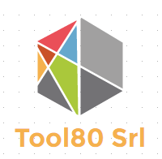

Tool80srl is a SME company located in North Italy. It carries out research and development activities in the field of coding and decoding of multimedia data streams (MPEG, MPAI). 
It also provides expertise on generic data streaming, such as open data, energy data, genomic data, and more generally about big data streaming.
Tool80 Srl provides consulting, design experience and system integration support on a variety of different platforms and AI algorithms.

## Tool80srl is an associate member of

[MPAI](https://www.mpai.community) is the international, unaffiliated, no-profit organisation developing standards for AI-based data coding with clear Intellectual Property Rights licensing frameworks.

## Tool80srl contacts:
- Località Cernidor 32 – 38123 – Trento (TN) – Italy
- VAT Num: 02459490229
- pec: tool80@pec.it
- email: [info@tool80.it](mailto:info@tool80.it)
- website: [www.tool80.it](https://www.tool80.it)

<footer>
&copy; 2017-2023 Tool80 srl
</footer>

